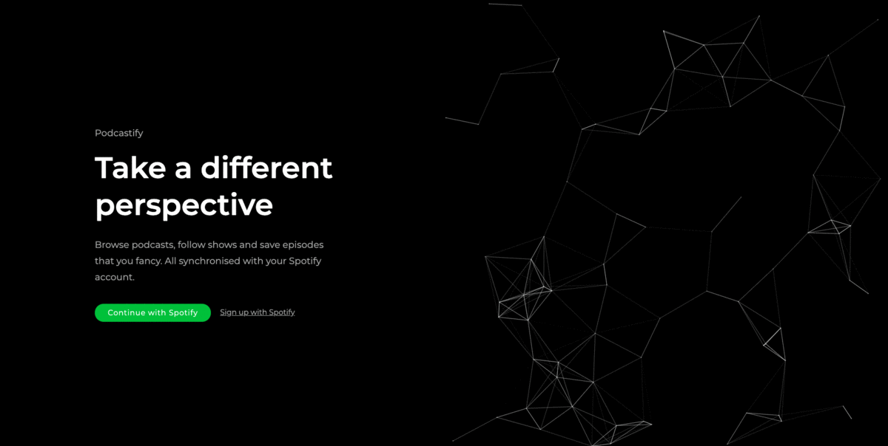
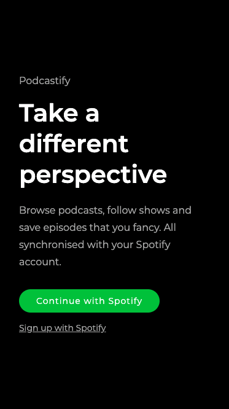

# Podcastify

## Description

Podcastify is a podcast browser powered by the Spotify API. It was created with
React, Node/Express and PostgreSQL as a hobby project.

Preview (it might take a few seconds before the server wakes up): https://podcastify.kamilmuzyka.com

## Showcase

